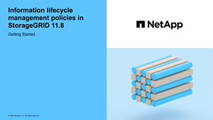

= Manage objects with ILM
:icons: font
:imagesdir: ../media/

[.lead]
The information lifecycle management (ILM) rules in an ILM policy instruct StorageGRID how to create and distribute copies of object data and how to manage those copies over time.

== About these instructions

Designing and implementing ILM rules and policies requires careful planning. You must understand your operational requirements, the topology of your StorageGRID system, your object protection needs, and the available storage types. Then, you must determine how you want different types of objects to be copied, distributed, and stored.

Use these instructions to:

* Learn about StorageGRID ILM, including link:how-ilm-operates-throughout-objects-life.html[how ILM operates throughout an object's life].
* Learn how to configure link:what-storage-pool-is.html[storage pools], link:what-cloud-storage-pool-is.html[Cloud Storage Pools], and link:what-ilm-rule-is.html[ILM rules].
* Learn how to link:creating-ilm-policy.html[create, simulate, and activate an ILM policy] that will protect object data across one or more sites.
* Learn how to link:managing-objects-with-s3-object-lock.html[manage objects with S3 Object Lock], which helps to ensure that objects in specific S3 buckets aren't deleted or overwritten for a specified amount of time.

== Learn more

To learn more, review these videos:

* https://netapp.hosted.panopto.com/Panopto/Pages/Viewer.aspx?id=9872d38f-80b3-4ad4-9f79-b1ff008760c7[Video: ILM rules overview^].
+
image::../media/video-screenshot-ilm-rules-118.png[link="https://netapp.hosted.panopto.com/Panopto/Pages/Viewer.aspx?id=9872d38f-80b3-4ad4-9f79-b1ff008760c7" alt="Video: ILM rules overview", window=_blank]

* https://netapp.hosted.panopto.com/Panopto/Pages/Viewer.aspx?id=e768d4da-da88-413c-bbaa-b1ff00874d10[Video: ILM policies overview^]
+
