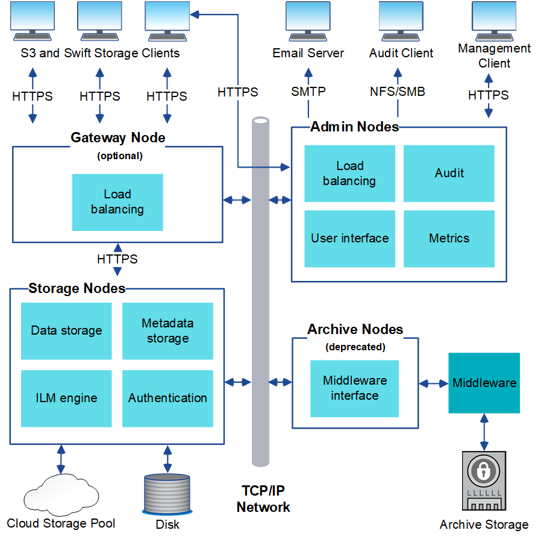

= StorageGRID architecture and network topology
:icons: font
:imagesdir: ../media/

[.lead]
A StorageGRID system consists of multiple types of grid nodes at one or more data center sites.

See the link:nodes-and-services.html[descriptions of grid node types].

For additional information about StorageGRID network topology, requirements, and grid communications, see the link:../network/index.html[Networking guidelines].

== Deployment topologies

The StorageGRID system can be deployed to a single data center site or to multiple data center sites.

=== Single site

In a deployment with a single site, the infrastructure and operations of the StorageGRID system are centralized.

image::../media/data_center_site_single.png[Single Data Center Site]

=== Multiple sites

In a deployment with multiple sites, different types and numbers of StorageGRID resources can be installed at each site. For example, more storage might be required at one data center than at another.

Different sites are often located in geographically different locations across different failure domains, such as an earthquake fault line or flood plain. Data sharing and disaster recovery are achieved by automated distribution of data to other sites.

image::../media/data_center_sites_multiple.png[Multiple Data Center Site]

Multiple logical sites can also exist within a single data center to allow the use of distributed replication and erasure coding for increase availability and resiliency.

=== Grid node redundancy

In a single-site or multi-site deployment, you can optionally include more than one Admin Node or Gateway Node for redundancy. For example, you can install more than one Admin Node at a single site or across several sites. However, each StorageGRID system can only have one primary Admin Node.

== System architecture

This diagram shows how grid nodes are arranged within a StorageGRID system.

S3 clients store and retrieve objects in StorageGRID. Other clients are used to send email notifications, to access the StorageGRID management interface, and optionally to access the audit share.

S3 clients can connect to a Gateway Node or an Admin Node to use the load-balancing interface to Storage Nodes. Alternatively, S3 clients can connect directly to Storage Nodes using HTTPS.

Objects can be stored within StorageGRID on software or hardware-based Storage Nodes, or in Cloud Storage Pools, which consist of external S3 buckets or Azure Blob storage containers.
